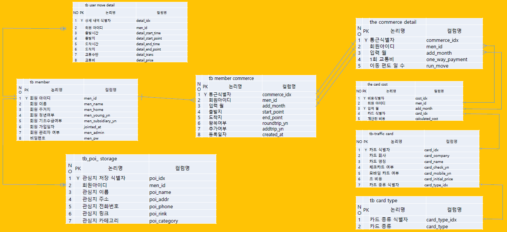

## SAVEUS : 경제적 부담을 줄여주는 교통패스 추천 서비스

### 📌 프로젝트 개요

- 교통비와 물가 상승으로 인한 경제적 부담을 줄이기 위해 개발된 최적화된 교통카드 추천 서비스 
- 다양한 교통패스 옵션 중에서 사용자에게 가장 적합한 선택을 제안하여 시민들의 혼란을 해결하고 교통비 절감을 유도
 

### 📌 주요 기능

- **맞춤형 교통카드 추천**
  
  : 출퇴근/등하교 패턴을 기반으로 한 달 교통비를 계산하고 최적의 교통카드를 추천
- **비용 시각화**

  : 다양한 할인율이 적용된 교통카드별 예상 비용을 대시보드로 시각화
- **사용 내역 확인**

  : 교통비 사용 내역을 달력 형태로 한눈에 확인 가능
 
  
### 📌 Target

- 대중교통을 이용하여 등하교/출퇴근하는 사람들
 

### 📌 ERD (Entity-Relationship Diagram)

 

### 📌 사용된 API

- **ODSay**
  
  : 대중교통 OPEN API를 활용하여 교통비 계산 알고리즘에 이용
- **Full Calendar API**

  : 사용 내역 시각화에 활용
 

### 📌 기술 스택

#### Frontend
- Vue.js
- HTML/CSS
- Node.js
- Chart.js

#### Backend
- Django
- Python

#### Database
- MySQL
 

### 📌 최적화 계산 알고리즘

이동 거리 및 이동 횟수를 고려하여 다음 옵션들을 비교 분석 :

- **일반 요금**
- **기후동행카드**
  - 사용 가능 역 및 가능 버스 노선 고려
- **K-패스**
  - **The경기패스**
  - **인천I-패스**
  - 23개의 **카드사별 추가 할인 혜택** 적용
 

